Building AI/ML-driven Business Process Automation
=============================

This is a hands-on workshop to build an intelligent AI/ML-bot on Symphony, a secure collaboration platform, to automate the Know-Your-Customer (KYC) on-boarding process using Amazon Lex, Lambda and Amazon Textract.

## Solution Architecture
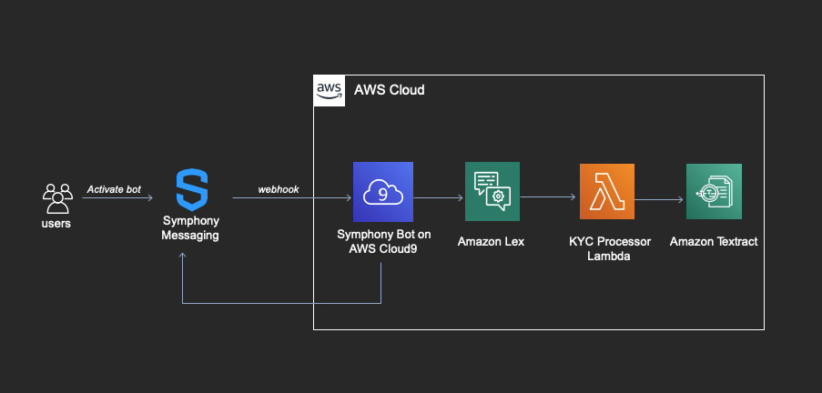

---
## Usecase

To demonstrate the concepts, we will use a simple customer on-boarding example at a bank. This implementation only goes as far as it needs to be demonstrate the concepts and is not by any stretch a real customer on-boarding implementation.

**We will build an intelligent bot that interacts with the users and guides them through 2 on-boarding experiences:**
- **Manual (e.g. by Bank Employee):** Workflow for manual information entry. (Lex, Lambda)
- **Automated Uploads:** Smart information capture and validation from 2 documents uploaded by the user for automatic on-boarding. (Lex, Lambda, Textract)

Here is the flow of the interaction:

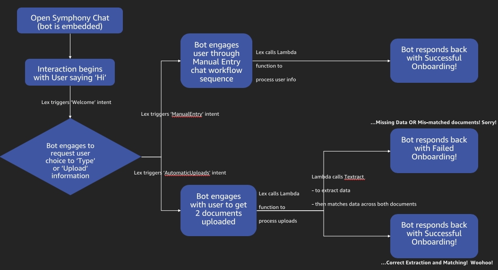

---

## PART 1 - Create an Amazon Lex Bot for the conversational flows

Amazon Lex is a service for building conversational interfaces into any application using voice and text. It provides the advanced deep learning functionalities of automatic speech recognition (ASR) for converting speech to text, and natural language understanding (NLU) to recognize the intent of the text, to enable you to build applications with highly engaging user experiences and lifelike conversational interactions.

* Amazon Lex FAQ: https://aws.amazon.com/lex/faqs/
* Amazon Lex "How it Works": https://docs.aws.amazon.com/lex/latest/dg/how-it-works.html

To create the above conversational flows, we will build the following:
(make sure you select the **same Region** in the AWS Console throughout the lab)

* Lex Bot
  * AWS Console --> Amazon Lex Service --> Bots --> Create Bot
  * Select 'Custom Bot' --> Provide a name 'CustomerSignUp' for the Bot --> Output Voice 'None' --> Session timeout 5 mins --> COPPA 'No' --> Create

* Intents

  An intent represents an action that the user wants to perform. You create a bot to support one or more related intents. We will create 3 Intents for the Bot based on above interaction flow.

  1. 'Welcome' Intent: To welcome the user and elicit user selection for Manual workflow or Automated Uploads.
    * Select your bot --> Click '+' next to Intents --> Create Intent --> name it 'WelcomeIntent'
    * Configure Utterances and Slots:

      Utterances - Natural responses by the user to trigger this intent.

      Slots - These are fields in which to capture the user choices/selections. Each slot has a type. You can create your custom slot types or use built-in slot types. For this lab, we will use the built-in slot types as below.

      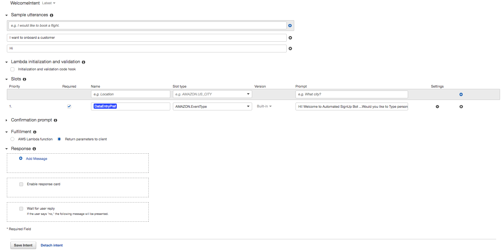
    * Keep other options default --> Save Intent.

  2. 'GatherPersonalInfo' Intent: To gather user information manually through interactive workflow
        * Select your bot --> Click '+' next to Intents --> Create Intent --> name it 'GatherPersonalInfo'
        * Configure Utterances and Slots:

          Utterances - Natural responses by a user to trigger this intent (workflow). E.g. user says/enters 'Type'

          Slots - These are fields in which to capture the user responses to questions within a information gathering workflow. Refer image below for the Slot Types used.

          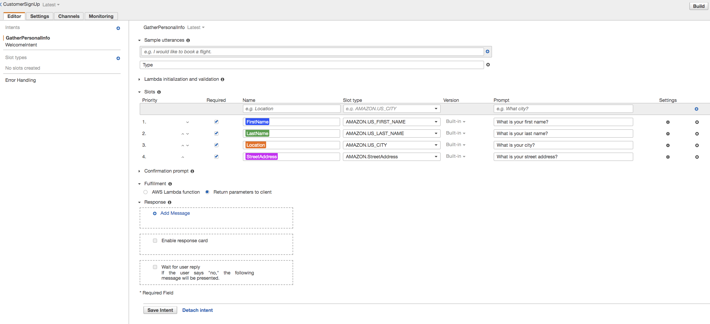
        * Keep other options default --> Save Intent. (We will configure a Lambda function for Fulfillment of the intent in the next step)

  3. 'HandleDocumentUploads' Intent: To capture user information automatically through a 2-document upload workflow
        * Select your bot --> Click '+' next to Intents --> Create Intent --> name it 'HandleDocumentUploads'
        * Configure Utterances and Slots:

          Utterances - Natural responses by a user to trigger this intent (workflow)
          E.g. user says/enters 'Upload'  

          Slots - These are fields in which to capture the user responses to questions within a uploads workflow. Refer image below for the Slot Types used.

          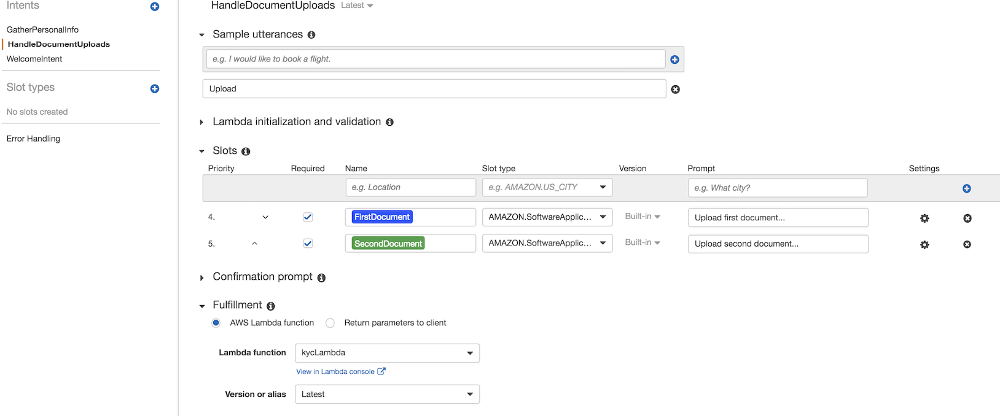
        * Keep other options default --> Save Intent. (We will configure a Lambda function for Fulfillment of the intent in the next step)

---

## PART 2 - Create a Cloud9 Environment
 1. Create a Cloud9 environment from the console in same region . Accept default settings to new a new Environment.

  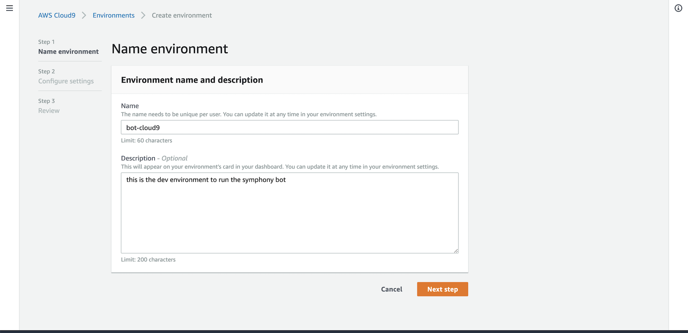

  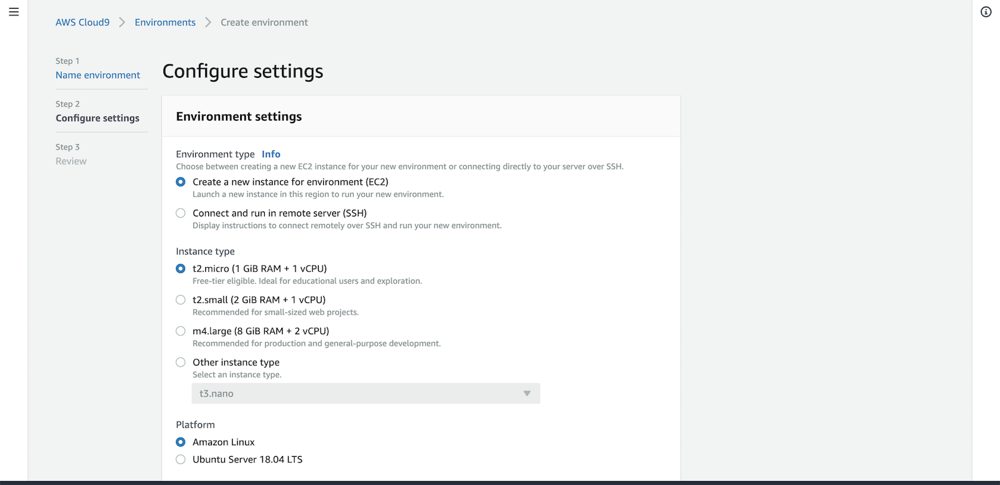

  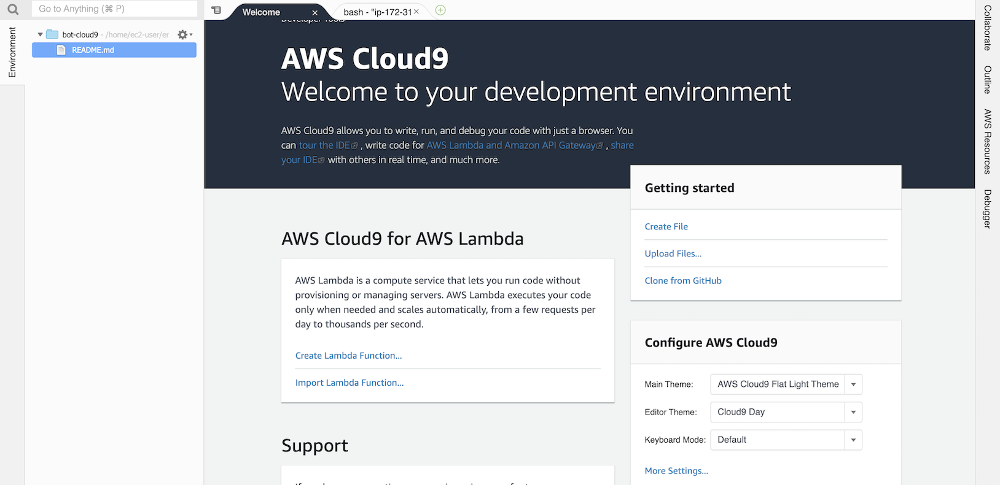

  2. Clone the repository to get code for the workshop and enter this command in terminal window  

  `git clone https://github.com/aws-samples/running-aws-ai-bots-on-symphony.git`

  3. Navigate and Right-click on /running-aws-ai-bots-on-symphony/kyc-lambda/boto3-layer.zip in Cloud9 explorer and    select Download it to local machine.

## PART 3 - Implement an AWS Lambda function to fulfill the above intents.

The lambda function will be invoked by the Lex bot for fulfillment of the above workflow intents. It will -
- for 'GatherPersonalInfo' intent :
  * simulate validation of entered data and return Successful on-boarding result back to Lex Bot.

- for 'HandleDocumentUploads' :
  * invoke **Amazon Textract** to extract textual information from the 2 documents (images) uploaded by the user.
  * run comparison checks on the extracted textual information from the 2 documents and then based on that return a Successful on-boarding result or failure due to missing or mismatched information.

To create and integrate the lambda function, follow the steps below -

1. Add the Lambda layer (Boto3- Python SDK layer, needed for Textract functions)
  - AWS Lambda Console --> Layers --> Create layer
  - Add Name (name it - 'onboardBoto3Layer'), Description, Upload boto3-layer.zip (downloaded earlier)
    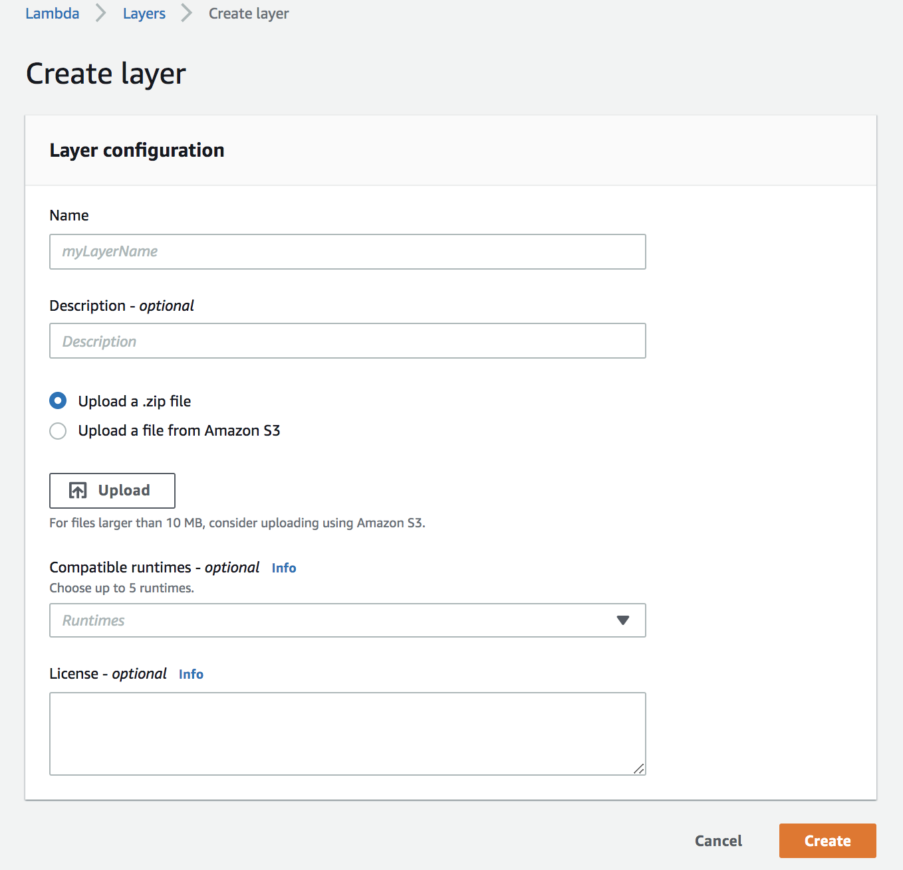
  - Select 'Python 3.7' for compatible runtime --> Create

2. Create a role for Lambda
  - AWS IAM Console --> Create role
  - Name the role  'onboardLambdaRole'
  - Add permissions policies for 'Lambda Basic execution' and 'TextractFullAccess'

3. Add the Lambda function (onboard_customer.py)
  - AWS Lambda Console --> Create function
  - Enter
    - Function Name = 'onboard_customer'
    - Runtime = 'Python 3.7'
    - Permissions --> Choose existing role --> 'onboardLambdaRole' (the one created above)
    - In the Design section -->  click Layers --> click 'Add a layer'
    - Select Name = layer name created above, Version = 1
    - Click on 'onboard_customer' lambda function in Designer again. (so you are out of the Layer focus)
    - Copy-Paste the Function code from onboard_customer.py (/running-aws-ai-bots-on-symphony/AWS-AI-Bots-on-Symphony/kyc-lambda/onboard_customer.py)
    - Increase Basic settings --> Timeout to 10 seconds
    - Save

   

  4. Goto the Lex Console and select new lambda (onboard_customer) for FullFillment for the two intents : GatherPersonalInfo and HandleDocumentUpload 
  5. Click on the Publish button and **select alias as "DEV"**. 
  
  * Testing

  To test out the workflows, you can test it out in the right pane 'Test bot'.   

---

## PART 4  - Embed the Lex bot within the Symphony platform  

### Setup the symphony account
Symphony is a secure collaboration platform and you will need to login to the platform to test the bot.
- **Url:** develop2.symphony.com
- **Email and Password:** The email and password is provided on the Event Engine Dashboard at reInvent.

A symphony bot is an automated system user that engages in conversations with symphony users and can be used to  implement a business process.
Each participant is assigned a unique bot for this workshop - the bot name is mentioned Event Engine dashboard.

The bot essentially runs outside the symphony platform and interacts with a listener that pushes out messages that are addressed to the bot.
In this case, we have implemented the bot in a cloud9 environment (other runtime are acceptable as well)

### Build the Symphony bot (hook)

Login to the AWS Console using credentials from Event Engine

A Cloud9 environment and repository containing the source files needed for the workshop were setup in PART 2

**Step 1** Symphony uses PKI authentication a bot listener to the bot agent running within Symphony platform. Each workshop participant is provided with private key in Event Engine
1. Navigate to bot_rsa file at /running-aws-ai-bots-on-symphony/kyc-bot/rsa/bot_rsa
2. Paste the private key (replace the placeholder key - "PASTE KEY HERE")

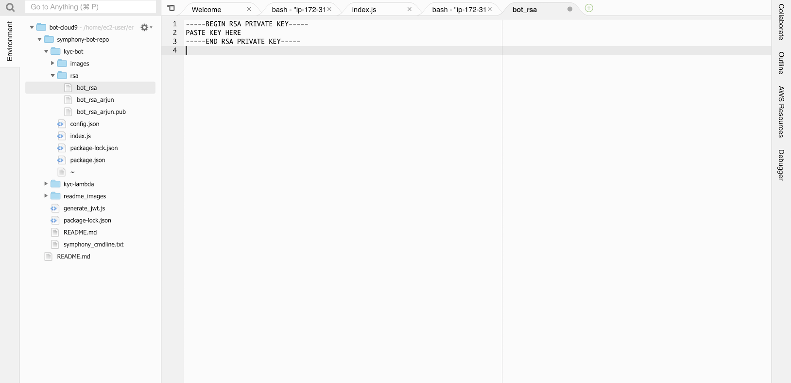

3. Open config.json at /running-aws-ai-bots-on-symphony/kyc-bot/config.json and update the following fields from what is received from Event Engine

 * botUsername
 * botEmailAddress

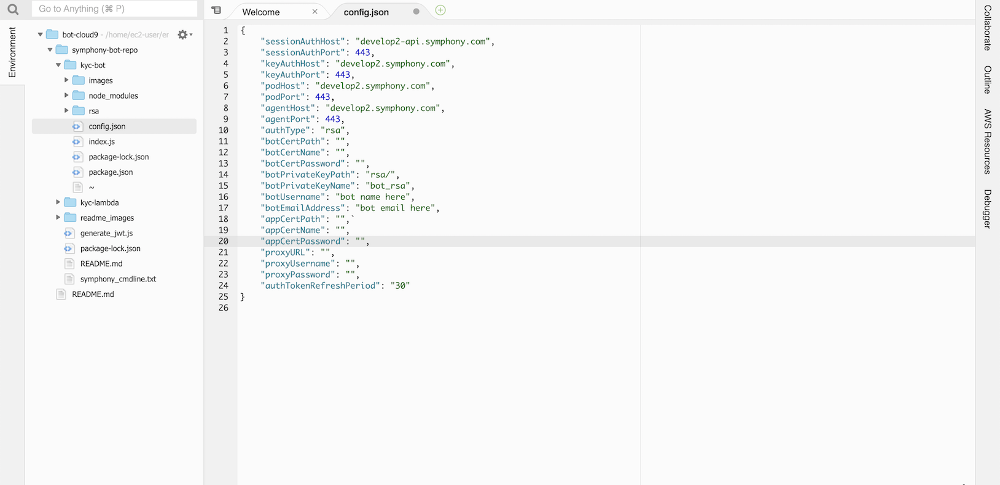

**Step 2** - Setup AWS credentials in Cloud9
<<TODO: How to setup AWS Credentials>>
**Step 3** - Start the bot to receive and send messages from Symphony
1. Execute the following commands on a Cloud9 terminal window

`cd symphony-bot-repo/kyc-bot`

`npm install`

`node index.js`

At this point, you should see this message

`--- Symphony Client initialization ---

The BOT kunal-aws-bot is ready to serve :-) Datafeed has no "error" handler`

The bot is now activated and can receive messages from symphony

**Step3**
1. Log into symphony platform at develop2.symphony.com with the credentials shared.
2. Search for the bot name shared earlier and begin to chat with it.

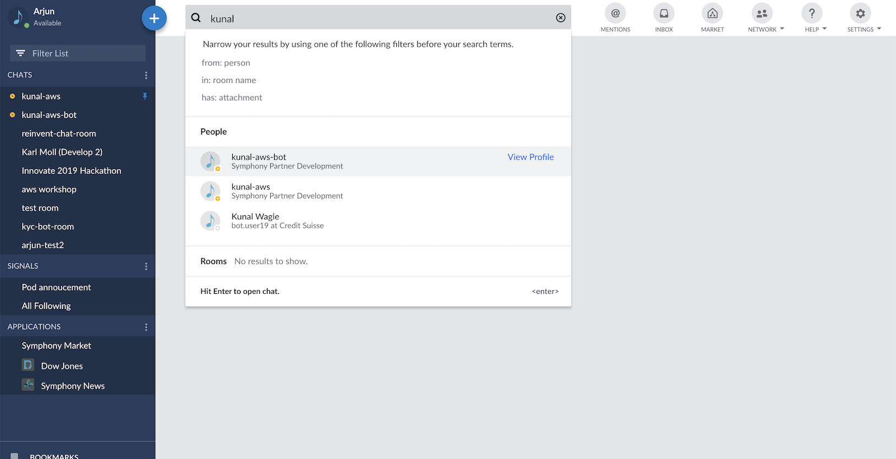

3. You can send messages to the bot and notice that listener in the Cloud9 environment is triggered. The bot is just configured to log the messages onto console.

**Step 4** - Use Amazon Lex to drive the conversation
1. To bring the smarts of the lex bot inside symphony, we need to pass incoming messages to Lex.
2. Enter `CTRL+C` to interrupt the bot listener
3. Navigate to index.js at /symphony-bot-repo/kyc-bot/ and comment Line 83 and Uncomment Line 84. Save the file.
4. Run `node index.js` to restart the bot listener  

---

## PART 5 - Putting it all together
Now that all the pieces of the puzzle are connected, lets see the whole thing in action.

**Step 1** Test the document update flow  
1. type Hi to the bot and answer
**Step 2** Test the conversational flow

To give yourself administrator permissions on the chat, you will have to type `/role [your-name]` in the app console.

---

## License
>You can check out the full license [here](https://github.com/IgorAntun/node-chat/blob/master/LICENSE)

This project is licensed under the terms of the **MIT** license.
